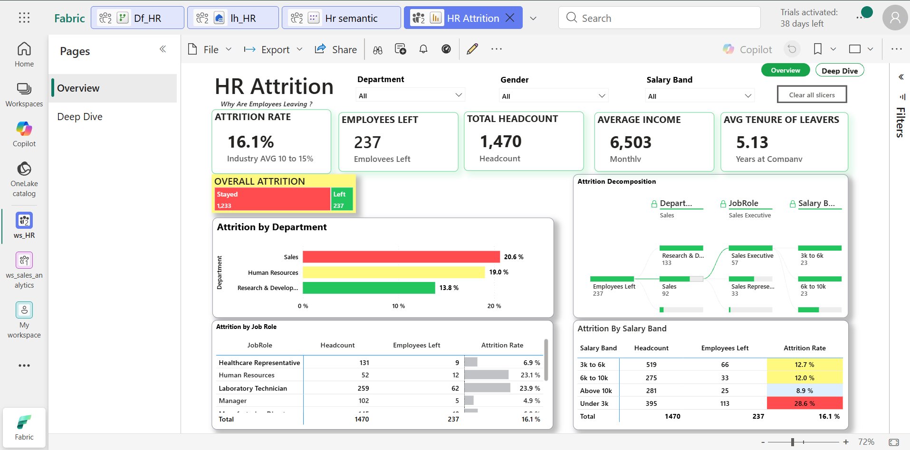
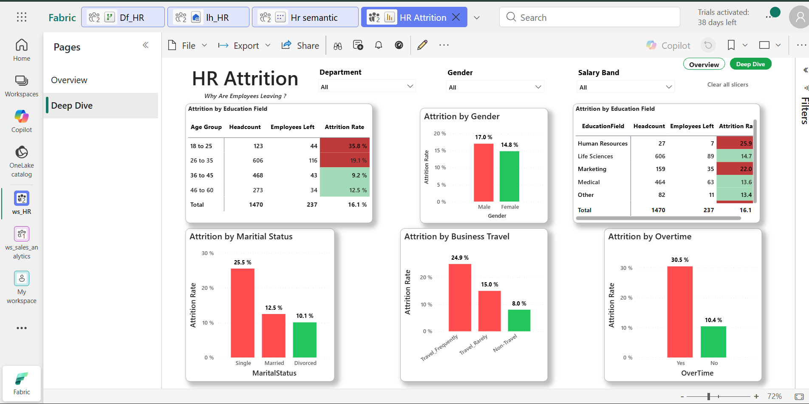
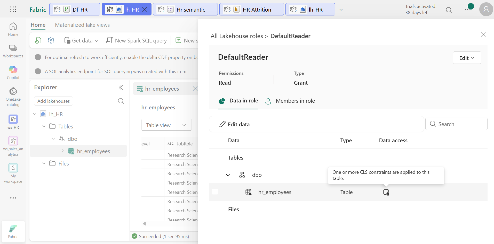

# HR Attrition Analytics — End-to-End Microsoft Fabric Solution

An end-to-end HR analytics solution built on Microsoft Fabric, answering a single business question: **why are employees leaving?**

The project ingests 1,470 employee records, transforms them into a governed Delta lakehouse, models them into a semantic layer, and serves a two-page Power BI report over DirectLake — with column-level security, row-level security, and sensitivity labels applied so HR data stays protected in the hands of the people who should see it.



---

## Business Context

Attrition is expensive. Replacing a single employee typically costs a multiple of their salary once recruitment, onboarding, and lost productivity are counted. Most HR teams know their headline attrition number but not *which* segments are driving it.

This solution moves an HR team from "our attrition is 16.1%" to "our attrition is concentrated in Sales, in employees under 25, in the lowest salary band, and — above all — in employees working overtime."

---

## Architecture

```
IBM HR Dataset (CSV)
        │
        ▼
  Dataflows Gen2  ──────────►  Lakehouse (lh_HR)
   (Power Query:                  Delta tables
    typing, cleansing,               │
    derived columns)                 ▼
                              PySpark Notebooks
                            (transformation, banding,
                             age/tenure grouping)
                                     │
                                     ▼
                            Semantic Model (Hr semantic)
                              Star schema + DAX measures
                                     │
                                DirectLake
                                     │
                                     ▼
                            Power BI Report (HR Attrition)
                             Overview  │  Deep Dive
```

**Governance layer** sits across the lakehouse and semantic model: OneLake column-level security, dynamic row-level security, and a Confidential sensitivity label.

---

## Tech Stack

| Layer | Technology |
|---|---|
| Platform | Microsoft Fabric, OneLake, Lakehouse architecture |
| Ingestion | Dataflows Gen2, Power Query (M) |
| Transformation | PySpark, Spark notebooks, Delta tables |
| Modelling | Star schema, semantic model, DirectLake |
| Analytics | DAX measures, Power BI report design |
| Governance | OneLake Security (RLS / CLS), sensitivity labels |
| Languages | SQL, Python, DAX, M |

---

## Dataset

**IBM HR Analytics Employee Attrition & Performance** (public dataset, 1,470 records, 35 attributes).

Key fields used: `Attrition`, `Department`, `JobRole`, `MonthlyIncome`, `Age`, `Gender`, `MaritalStatus`, `BusinessTravel`, `OverTime`, `EducationField`, `YearsAtCompany`.

Derived fields created during transformation:
- **Salary Band** — `Under 3k`, `3k to 6k`, `6k to 10k`, `Above 10k`
- **Age Group** — `18 to 25`, `26 to 35`, `36 to 45`, `46 to 60`
- **Attrition Flag** — numeric flag enabling rate calculations at any grain

---

## Data Pipeline

**1. Ingest** — Dataflows Gen2 pulls the raw HR file into the Fabric Lakehouse, handling type enforcement and null cleansing in Power Query before landing the data as a Delta table.

**2. Transform** — PySpark notebooks derive the banding columns (salary, age), standardise categorical values, and write curated Delta tables into the `dbo` schema of `lh_HR`.

**3. Model** — A semantic model is built on top of the curated tables in DirectLake mode, so the report reads Delta files directly from OneLake with no import refresh and no data duplication.

**4. Serve** — A two-page Power BI report with cross-filtering slicers on Department, Gender, and Salary Band.

---

## DAX Measures

Core measures powering every visual in the report:

```dax
Total Headcount = COUNTROWS('hr_employees')

Employees Left =
CALCULATE(
    COUNTROWS('hr_employees'),
    'hr_employees'[Attrition] = "Yes"
)

Attrition Rate =
DIVIDE([Employees Left], [Total Headcount], 0)

Avg Monthly Income =
AVERAGE('hr_employees'[MonthlyIncome])

Avg Tenure of Leavers =
CALCULATE(
    AVERAGE('hr_employees'[YearsAtCompany]),
    'hr_employees'[Attrition] = "Yes"
)
```

Conditional formatting rules drive the red/amber/green colour logic on the rate columns, benchmarked against a 10–15% industry average band.

---

## Report Pages

### Overview — the headline picture


| KPI | Value |
|---|---|
| Attrition Rate | 16.1% |
| Employees Left | 237 |
| Total Headcount | 1,470 |
| Average Monthly Income | 6,503 |
| Avg Tenure of Leavers | 5.13 years |

Visuals: KPI cards, stayed-vs-left proportion bar, attrition rate by department, a decomposition tree drilling Department → JobRole → Salary Band, an attrition-by-job-role table, and an attrition-by-salary-band table.

### Deep Dive — the drivers



Breakdowns by age group, gender, education field, marital status, business travel frequency, and overtime — the six dimensions that separate leavers from stayers most sharply.

---

## Key Findings

**Overtime is the single strongest predictor.** Employees working overtime leave at **30.5%** versus **10.4%** for those who don't — roughly a 3× difference, and the widest gap in the entire dataset.

**Attrition is front-loaded in early career.** The 18–25 group churns at **35.8%** and 26–35 at **19.1%**, against just **9.2%** for 36–45. Combined with an average leaver tenure of 5.13 years, this points at an onboarding-and-progression problem rather than a late-career one.

**Pay band matters more than department.** The `Under 3k` band churns at **28.6%**, more than triple the **8.9%** of the `Above 10k` band. Department spread is narrower by comparison — Sales **20.6%**, Human Resources **19.0%**, Research & Development **13.8%**.

**Travel and marital status compound the risk.** Frequent travellers leave at **24.9%** versus **8.0%** for non-travellers, and single employees at **25.5%** versus **10.1%** for divorced employees.

**The composite risk profile:** a single employee under 25, in the lowest salary band, working overtime and travelling frequently, in a Sales role. That is the segment retention spend should target first.

---

## Security & Governance

Governance was treated as a first-class requirement, not an afterthought — HR data is among the most sensitive data an organisation holds.



### Column-Level Security (OneLake Security)
A `DefaultReader` role is defined at the lakehouse level with Read permission, with CLS constraints applied to the `hr_employees` table. Sensitive compensation and personal attributes are masked from the role, so users querying through the SQL analytics endpoint or Spark cannot see columns they aren't entitled to — the restriction lives with the data in OneLake, not just in the report.

### Row-Level Security
Dynamic RLS is implemented in the semantic model using DAX and `USERPRINCIPALNAME()`, mapping the signed-in user to their department so each department head sees only their own team's records:

```dax
[Department] = LOOKUPVALUE(
    'security_mapping'[Department],
    'security_mapping'[UserPrincipalName], USERPRINCIPALNAME()
)
```

### Sensitivity Labels
A **Confidential** sensitivity label is applied and inherited downstream through the lakehouse, semantic model, and report, so protection travels with any export.

---

## Repository Structure

```
├── README.md
├── .gitignore
└── screenshots/
    ├── report-overview.png
    ├── report-deep-dive.png
    └── onelake-cls.png
```

## What I Took Away From This

The reporting was the easy part. The genuinely instructive work was governance: understanding that column-level security enforced in OneLake behaves differently from RLS enforced in the semantic model, and that both are needed — one protects the data wherever it's queried from, the other shapes what a specific person sees in a specific report. Getting DirectLake to work cleanly alongside those constraints, without silently falling back to DirectQuery, was the part that took the most iteration.

---

## Dataset Credit

IBM HR Analytics Employee Attrition & Performance — a fictional dataset created by IBM data scientists, published on Kaggle.
